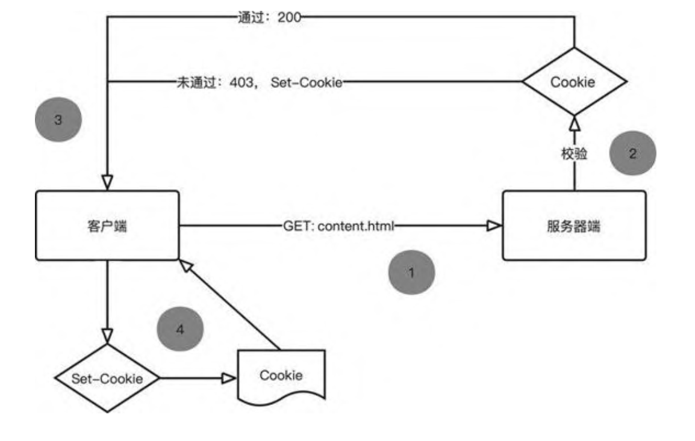
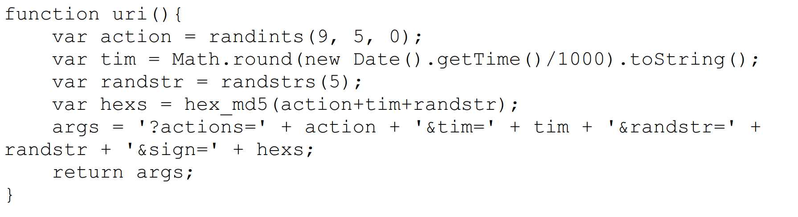

# 前言
- 最基础的爬虫操作是使用urllib与requests等解析页面
- 之后可以使用页解析库、数据库处理等更加方便的爬虫手段
- 使用Ajax、动态渲染页面、验证码、模拟登录等相关处理办法绕过平台的验证。
- 如何使用pyspider，Scrapy等爬虫框架

# Web网站的构成和页面渲染
## nginx服务器

nginx是一个HTTP 和反向代理服务器，同时也是邮件代理服务器和通用的TCP / UDP代理服务器。它具有模块化设计、可扩展、低内存消耗、支持热部署等优秀特性，所以非常多的Web应用将其作为服务器软件。  

### nginx的信号

信号（signal）是控制nginx工作状态的模块，我们可以在终端使用信号来控制nginx的启动、停止和配置重载等。  

```
nginx -s signal
```

更多nginx信号的知识可前往nginx官方文档查看，详见http://nginx.org/en/docs/control.html  

### nginx配置文件

nginx的配置文件分为主配置文件和辅助配置文件：主配置文件名为nginx.conf，默认存放在 /etc/nginx目录中；辅助配置文件要求以 .conf作为文件后缀，并且默认存放在 /etc/nginx/conf.d目录中。  

### 小结

nginx具有条件判断、连接限制和客户端信息获取等功能，这些功能为开发者限制爬虫程序提供了条件。  

## 浏览器

爬虫程序可以模拟浏览器向服务器端发起网络请求，它们得到的资源与正常访问服务器端得到的资源是相同的，但显示的内容却不同。这是因为浏览器具有解释HTML、JavaScript和CSS的能力，而爬虫程序不具备这些能力，这个差异造成爬虫程序无法做到“所见即所得”。很多反爬虫手段利用了浏览器和爬虫程序之间的差异，因此要想深入理解反爬虫，我们必须了解浏览器的相关知识。  

- 用户界面 ：包括地址栏、前进/后退/刷新等按钮、页面主窗口
  等。
- 浏览器引擎 ：负责将用户的操作传递给对应的渲染引擎。
- 渲染引擎 ：能够调用解释器解释HTML、CSS和JavaScript代码，然后根据解释结果重排页面并绘制渲染树。
- HTML解释器 ：解释HTML代码。
- JavaScript解释器 ：解释JavaScript代码。
- CSS解释器 ：解释CSS代码。
- 界面后端 ：绘制组合框和窗口等基本部件。
- 数据存储 ：在本地存储一些体积较小的数据，如Cookie、Storage对象等。
- 网络 ：自动加载HTML文档中所需的其他资源。  


DOM是W3C组织推荐的处理可扩展标志语言的标准编程接口。在网页中，组织页面或文档的对象被放在一个树形结构中，其中用来表示对象的标准模型就称为DOM。DOM能够以一种独立于平台和语言的方式访问和修改一个文档的内容和结构。它是表示和处理一个HTML或XML文档的常用方法。DOM的设计以对象管理组织（OMG）的规约为基础，因此可以用于任何编程语言。  

**JavaScript和CSS对网页内容的改变实际上是对DOM的操作，而非直接改变HTML。**  

## 网络协议


- 协议类型名称 ：表示浏览器必须使用的协议，通常是HTTP协议
  或其安全版本HTTPS。
- 域名 ：表示正在请求哪个Web服务器，也可以直接使用主机地
  址。
- 端口号 ：用于表示Web服务器上的资源入口，如Web服务器使用
  HTTP协议的标准端口号（HTTP为80，HTTPS为443）来授予对其资源的访问权限。
- 资源路径 ：Web服务器上资源的路径，在Web的早期，这样的路
  径代表了Web服务器上的物理文件位置，如今它主要是由Web服务器处理的抽象标识。
- 查询参数 ：用&符号分隔的键值对。在将资源返回给用户之前，
  Web服务器可以使用这些参数来执行额外的操作。每个Web服务器都有自己的参数规则，了解特定Web服务器如何处理参数的唯一可靠方法是询问Web服务器的所有者或应用程序的开发者。
- 锚点 ：资源内部的一种“书签”，浏览器会根据锚点将对应的内容呈现给用户，而不需要用户滑动页面来寻找内容。例如，在HTML文档中，浏览器将滚动到定义锚点的位置；在视频或音频文档中，浏览器将尝试转到锚点所代表的时间。值得注意的是，# 之后的部分（也称片段标识符）永远不会随请求一起发送到服务器。  

### HTTP请求与响应  


- Accept ：客户端希望接受的数据类型，比如Accept: text/html 代表客户端希望接受的数据类型是HTML类型。
- Accept-* ：指定客户端可接受的内容，比如AcceptEncoding 用于指定可接受的编码，Accept-Language 用于指定可接受的语言类型。  
- Content-Type ：互联网媒体类型（简称MIME类型），代表具体请求的媒体类型信息（比如text/html 代表HTML格式，image/gif 代表GIF图片，application/json 代表JSON类型）。
- Host ：指定请求资源的域名（或IP）和端口号，内容为请求URL的原始服务器或网关的位置。
- Cookie ：可以理解为在HTTP协议下，服务器或其他脚本语言维护客户端信息的一种方式，是保存在客户端（比如浏览器）的文本文件。Cookie中往往包含客户端或者用户的相关信息。
- Referer ：记录上一次访问的页面地址，也可以理解为标识此次请求的来源URL。  

### Cookie

Cookie是通过客户端来保持状态的解决方案。从定义上来说，Cookie就是由服务器发给客户端的特殊信息，这些信息以文本文件的形式存放在客户端。  

Cookie在生成时会被指定一个Expire 值，该值就是Cookie的生存周期。Cookie在这个周期内是有效的，但是超出周期后就会被清除。  

### WebSocket

WebSocket协议使客户端和服务器端之间的数据交换变得更加简单，它允许交互双方创建持久连接，同时支持服务器端主动向客户端推送数据。

在WebSocket协议出现之前，如果Web应用想要实现消息推送与实时数据展示功能，那么需要使用轮询的手段。轮询指的是客户端以特定的时间间隔向服务器端发出HTTP请求，服务器端返回最新的数据给客户端的过程。这种传统模式的缺点很明显，客户端需要不断地向服务器端发出请求，而HTTP请求可能包含较长的头部，但其中真正有效的数据可能只是很小的一部分，显然这样会浪费很多的带宽资源。  

# 爬虫与反爬虫

## 动态网页与网页源代码  

- 静态网页指的是网页主体内容的渲染工作在服务器端完成，并通过响应正文返回的网页。
- 动态网页指的是主体内容或者全部内容都需要客户端执行JavaScript 代码来计算或渲染的网页。  

## 反爬虫

本书约定，限制爬虫程序访问服务器资源和获取数据的行为称为反爬虫。  

**主动型反爬虫**：开发者有意识地使用技术手段区分正常用户和爬虫，并限制爬虫对网站的访问行为，如验证请求头信息、限制访问频率、使用验证码等。

**被动型反爬虫**：为了提升用户体验或节省资源，用一些技术间接提高爬虫访问难度的行为，比如数据分段加载、点击切换标签页、鼠标悬停预览数据等。  

# 信息校验型反爬虫  

信息校验中的“信息”指的是客户端发起网络请求时的请求头和请求正文，而“校验”指的是服务器端通过对信息的正确性、完整性或唯一性进行验证或判断，从而区分正常用户和爬虫程序的行为。  

## User-Agent 反爬虫  

除了User-Agent之外，常见的用于反爬虫的头域还有 Host 和 Referer。这种验证请求头信息中特定头域的方式既可以有效地屏蔽长期无人维护的爬虫程序，也可以将一些爬虫初学者发起的网络请求拒之门外，但是对于一些经验丰富的爬虫工程师，或许还需要更巧妙的反爬虫手段。  

## Cookie反爬虫



我们思考如何将 Cookie 和 JavaScript 结合起来实现反爬虫。  如果在 HTML 代码中引入一个可以将浏览器重定向到目标页面的 JavaScript 文件，并且在这个文件中实现随机字符串生成和Cookie 设置的功能，那么服务器端只需要校验 Cookie 值的规则即可。  

这种随机变化的 Cookie 值看起来很唬人，但是它依旧没有解决同一个值持续可用的问题。即使设置了 Cookie 的过期时间，这种由固定位置和固定数量字符拼接的字符串仍然很容易被看穿。

开发者也发现了这类问题，于是在 JavaScript 代码中生成当前时间的时间戳，将时间戳与随机字符串拼接后再作为 Cookie 值发起请求。这时候 nginx 不仅需要按规则校验随机字符串，还需要获取服务器的当前时间戳，将 Cookie 值中取出的时间戳与当前时间戳进行差值计算，当时间差值超过一定的时间（如 5 秒），则可以认定Cookie是伪造的  

# 签名验证反爬虫

签名是根据数据源进行计算或加密的过程，签名的结果是一个具有唯一性和一致性的字符串。签名结果的特性使得它成为验证数据来源和数据完整性的条件，可以有效避免服务器端将伪造的数据或被篡改的数据当成正常数据处理。



如随机生成的数字

本次的反爬虫利用 JavaScript 生成随机值，与之前的随机值不同，这次的随机值中包含时间戳和 MD5 加密值。签名验证有很多种实现方式，但原理都是相同的：由客户端生成一些随机值和不可逆的 MD5 加密字符串，并在发起请求时将这些值发送给服务器端。服务器端使用相同的方式对随机值进行计算以及 MD5 加密，如果服务器端得到的MD5 值与前端提交的 MD5 值相等，就代表是正常请求，否则返回403。 

 

# 动态渲染反爬虫

动态网页中常见的表现形式有下拉刷新、点击切换和悬停显示等。  

- 可以分析javascript请求，但是这种分析太麻烦。
- 进程可以使用Selenium。
- Puppeteer是异步爬虫的一种，splash则是分布式爬虫。

区别

- Selenium 套件通过驱动浏览器执行操作，本质上使用浏览器。
- Puppeteer 实际上通过 API 控制Chromium 或 Chrome 浏览器。
- Splash 基于开源的浏览器引擎 WebKit  

# 文本混淆反爬虫  

常见的文本混淆手段有图片伪装、文字映射和自定义字体等。  

## 图片伪装

- 向目标网站发起网络请求。
- 使用 Parsel 库从响应正文中提取图片名称，并将它与 URL 拼接成完整的地址。
- 向图片发起网络请求。
- 从响应正文中提取图片内容，并使用光学字符识别技术（PyTesseract库）从图片中提取文字  

## SVG 映射反爬虫 

用矢量图形代替具体的文字，不会影响用户正常阅读，但爬虫程序却无法像读取文字那样获得 SVG 图形中的内容。  

## 字体反爬虫

在 CSS3 之前，Web 开发者必须使用用户计算机上已有的字体。但是在 CSS3 时代，开发者可以使用@font-face 为网页指定字体，对用户计算机字体的依赖。开发者可将心仪的字体文件放在 Web 服务器上，并在 CSS 样式中使用它。用户使用浏览器访问 Web 应用时，对应的字体会被浏览器下载到用户的计算机上。  

由于字体的加载和映射工作是由 CSS 完成的，所以即使我们借助 Splash、Selenium和 Puppeteer 工具也无法获得对应的文字内容。字体反爬虫正是利用了这个特点，将自定义字体应用到网页中重要的数据上，使得爬虫程序无法获得正确的数据。  

## 通用解决办法

截图并文字识别。

收费的文字识别 API 的准确率和识别能力都超过免费开源的第三方库PyTesseract，但经济成本是爬虫工程师不得不考虑的问题。

# 特征识别反爬虫

## WebDriver 识别  

我们可以将爬虫的爬取过程分为网络请求、文本获取和数据提取3个部分。信息校验型反爬虫主要出现在网络请求阶段，这个阶段的反爬虫理念以预防为主要目的，尽可能拒绝爬虫程序的请求。动态渲染和文本混淆则出现在文本获取及数据提取阶段，这个阶段的反爬虫理念以保护数据为主要目的，尽可能避免爬虫获得重要数据。

特征识别反爬虫是指通过客户端的特征、属性或用户行为特点来区分正常用户和爬虫程序的手段。本章我们要介绍的特征识别反爬虫也是以预防为主要目的，直指爬虫出现的源头。接下来，我们一起学习特征识别反爬虫的原理和绕过技巧吧。  

Navigator 对象（即windows.navigator 对象）的webdriver 属性来判断客户端是否通过 WebDriver 驱动浏览器。如果检测到客户端的webdriver 属性，则在文章内容标签处显示“请不要使用自动化测试工具访问网页”，否则显示正确的文章内容。  

navigator.webdriver 只适用于使用 WebDriver 的渲染工具，对于 Splash 这种使用 WebKit 内核开发的渲染工具来说是无效的。  

# 验证码识别

**字符验证码**添加了干扰信息，可以有效增加识别难度和错误率。除了斜线和噪点外，还可以使用字符扭曲、角度旋转和文字重叠等方法。由于图像识别在深度学习领域已相当成熟，所以我们才能够轻松地完成验证码预测工作。本书对深度学习和卷积神经网络仅进行简单的介绍，感兴趣的读者可以深入了解相关知识。  

**计算型验证码**其实也是字符验证码的一种，但它增加了数学运算逻辑，所以难度相对较高。但只要能够识别图片中的字符，就能够通过校验。  

**滑动拼图验证码**分为滑动和拼图两个部分，滑动需要用到人类的行为，而拼图则需要用到人类的视觉。通过验证的关键是图片缺口，只要能够找到缺口位置，就能够通过验证。计算机要想通过验证，必须完成读懂要求、目标位置检测、文字识别和点击等操作。与本章前几节介绍的验证码相比，通过文字点选验证码校验需要的步骤和难度都增加不少，这也是它备受验证码厂商和网站经营者欢迎的原因。

**点选验证码**的关键是目标定位和识别。深度学习领域的目标检测技术已经非常成熟，它能够帮助我们快速而准确地定位到图片中的目标，并对目标进行分类。  

# 其他知识

## 编码与加密

字符集是指各国家的文字、标点符号、图形符号和数字等字符的集合。  

Base64 基于 64 个可打印字符来表示 8 位二进制数据，ASCII 编码实际上约定了字符和二进制的映射关系，如小写字母“a”对应的 8 位二进制数为 01100001。

Base64 被广泛应用在互联网中，有经验的爬虫工程师看到带有“==”符号或者“=”符号的字符串时，自然就会认为这是 Base64 编码字符串后得到的结果。  

## MD5

MD5 消息摘要算法（MD5 Message-Digest Algorithm，简称 MD5）是一种被广泛使用的散列函数，它能够将任意长度的消息转换成 128 位的消息摘要。  

- Append Padding Bits
- Append Length
- Initialize MD Buffer
- Process Message in 16-Word Blocks。
- Output

## 非对称加密

加密和解密时使用同一个密钥的加密方式叫作对称加密，使用不同密
钥的是非对称加密。

如果用私钥对数据进行加密，那么只有用对应的公钥才能够解密数据。由于加密和解密时使用的密钥是不相同的，所以这种加密方式被称为非对称加密。  

## JavaScript 代码混淆  

常用的混淆方法有正则替换、代码编码和代码复杂化等。为了防止有心人在浏览器中调试，开发者甚至会在代码中加入一些能够干扰调试的代码。  

- 正则替换之变量名替换  
- 正则替换之进制替换
- 代码编码之Base64  

- 代码编码之AAEncode

- 代码编码之JJEncode  

JavaScript 编译器的目的是将 JavaScript 代码编译为机器码，而混淆器的处理结果仍然是 JavaScript 代码。  

在实际项目中遇到的代码混淆可不止这么简单，大型网站的混淆规则和逻辑是非常复杂的。对抽象语法树和混淆器感兴趣的读者，可以前往 UglifyJS 官网了解更多知识。  