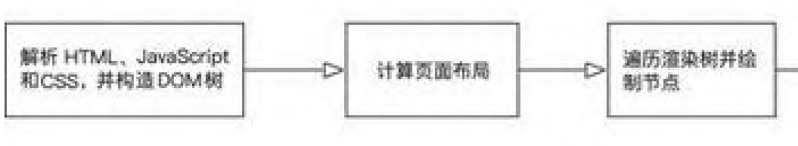
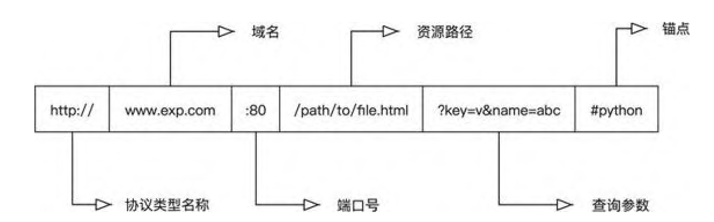
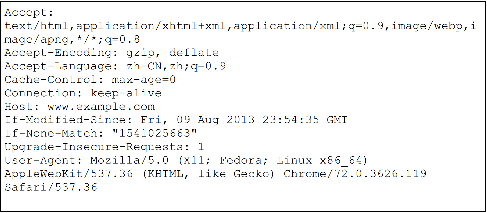

# 前言
- 最基础的爬虫操作是使用urllib与requests等解析页面
- 之后可以使用页解析库、数据库处理等更加方便的爬虫手段
- 使用Ajax、动态渲染页面、验证码、模拟登录等相关处理办法绕过平台的验证。
- 如何使用pyspider，Scrapy等爬虫框架

# Web网站的构成和页面渲染
## nginx服务器

nginx是一个HTTP 和反向代理服务器，同时也是邮件代理服务器和通用的TCP / UDP代理服务器。它具有模块化设计、可扩展、低内存消耗、支持热部署等优秀特性，所以非常多的Web应用将其作为服务器软件。  

### nginx的信号

信号（signal）是控制nginx工作状态的模块，我们可以在终端使用信号来控制nginx的启动、停止和配置重载等。  

```
nginx -s signal
```

更多nginx信号的知识可前往nginx官方文档查看，详见http://nginx.org/en/docs/control.html  

### nginx配置文件

nginx的配置文件分为主配置文件和辅助配置文件：主配置文件名为nginx.conf，默认存放在 /etc/nginx目录中；辅助配置文件要求以 .conf作为文件后缀，并且默认存放在 /etc/nginx/conf.d目录中。  

### 小结

nginx具有条件判断、连接限制和客户端信息获取等功能，这些功能为开发者限制爬虫程序提供了条件。  

## 浏览器

爬虫程序可以模拟浏览器向服务器端发起网络请求，它们得到的资源与正常访问服务器端得到的资源是相同的，但显示的内容却不同。这是因为浏览器具有解释HTML、JavaScript和CSS的能力，而爬虫程序不具备这些能力，这个差异造成爬虫程序无法做到“所见即所得”。很多反爬虫手段利用了浏览器和爬虫程序之间的差异，因此要想深入理解反爬虫，我们必须了解浏览器的相关知识。  

- 用户界面 ：包括地址栏、前进/后退/刷新等按钮、页面主窗口
  等。
- 浏览器引擎 ：负责将用户的操作传递给对应的渲染引擎。
- 渲染引擎 ：能够调用解释器解释HTML、CSS和JavaScript代码，然后根据解释结果重排页面并绘制渲染树。
- HTML解释器 ：解释HTML代码。
- JavaScript解释器 ：解释JavaScript代码。
- CSS解释器 ：解释CSS代码。
- 界面后端 ：绘制组合框和窗口等基本部件。
- 数据存储 ：在本地存储一些体积较小的数据，如Cookie、Storage对象等。
- 网络 ：自动加载HTML文档中所需的其他资源。  



DOM是W3C组织推荐的处理可扩展标志语言的标准编程接口。在网页中，组织页面或文档的对象被放在一个树形结构中，其中用来表示对象的标准模型就称为DOM。DOM能够以一种独立于平台和语言的方式访问和修改一个文档的内容和结构。它是表示和处理一个HTML或XML文档的常用方法。DOM的设计以对象管理组织（OMG）的规约为基础，因此可以用于任何编程语言。  

**JavaScript和CSS对网页内容的改变实际上是对DOM的操作，而非直接改变HTML。**  

## 网络协议



- 协议类型名称 ：表示浏览器必须使用的协议，通常是HTTP协议
  或其安全版本HTTPS。
- 域名 ：表示正在请求哪个Web服务器，也可以直接使用主机地
  址。
- 端口号 ：用于表示Web服务器上的资源入口，如Web服务器使用
  HTTP协议的标准端口号（HTTP为80，HTTPS为443）来授予对其资源的访问权限。
- 资源路径 ：Web服务器上资源的路径，在Web的早期，这样的路
  径代表了Web服务器上的物理文件位置，如今它主要是由Web服务器处理的抽象标识。
- 查询参数 ：用&符号分隔的键值对。在将资源返回给用户之前，
  Web服务器可以使用这些参数来执行额外的操作。每个Web服务器都有自己的参数规则，了解特定Web服务器如何处理参数的唯一可靠方法是询问Web服务器的所有者或应用程序的开发者。
- 锚点 ：资源内部的一种“书签”，浏览器会根据锚点将对应的内容呈现给用户，而不需要用户滑动页面来寻找内容。例如，在HTML文档中，浏览器将滚动到定义锚点的位置；在视频或音频文档中，浏览器将尝试转到锚点所代表的时间。值得注意的是，# 之后的部分（也称片段标识符）永远不会随请求一起发送到服务器。  

### HTTP请求与响应  



- Accept ：客户端希望接受的数据类型，比如Accept: text/html 代表客户端希望接受的数据类型是HTML类型。
- Accept-* ：指定客户端可接受的内容，比如AcceptEncoding 用于指定可接受的编码，Accept-Language 用于指定可接受的语言类型。  
- Content-Type ：互联网媒体类型（简称MIME类型），代表具体请求的媒体类型信息（比如text/html 代表HTML格式，image/gif 代表GIF图片，application/json 代表JSON类型）。
- Host ：指定请求资源的域名（或IP）和端口号，内容为请求URL的原始服务器或网关的位置。
- Cookie ：可以理解为在HTTP协议下，服务器或其他脚本语言维护客户端信息的一种方式，是保存在客户端（比如浏览器）的文本文件。Cookie中往往包含客户端或者用户的相关信息。
- Referer ：记录上一次访问的页面地址，也可以理解为标识此次请求的来源URL。  

### Cookie

Cookie是通过客户端来保持状态的解决方案。从定义上来说，Cookie就是由服务器发给客户端的特殊信息，这些信息以文本文件的形式存放在客户端。  

Cookie在生成时会被指定一个Expire 值，该值就是Cookie的生存周期。Cookie在这个周期内是有效的，但是超出周期后就会被清除。  

### WebSocket

WebSocket协议使客户端和服务器端之间的数据交换变得更加简单，它允许交互双方创建持久连接，同时支持服务器端主动向客户端推送数据。

在WebSocket协议出现之前，如果Web应用想要实现消息推送与实时数据展示功能，那么需要使用轮询的手段。轮询指的是客户端以特定的时间间隔向服务器端发出HTTP请求，服务器端返回最新的数据给客户端的过程。这种传统模式的缺点很明显，客户端需要不断地向服务器端发出请求，而HTTP请求可能包含较长的头部，但其中真正有效的数据可能只是很小的一部分，显然这样会浪费很多的带宽资源。  